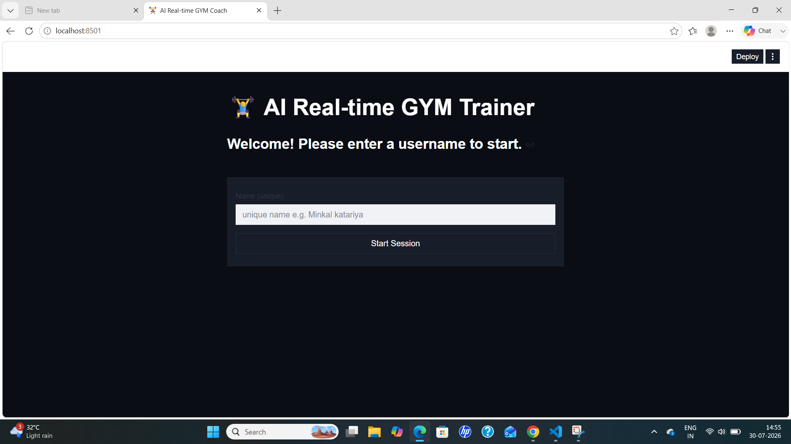
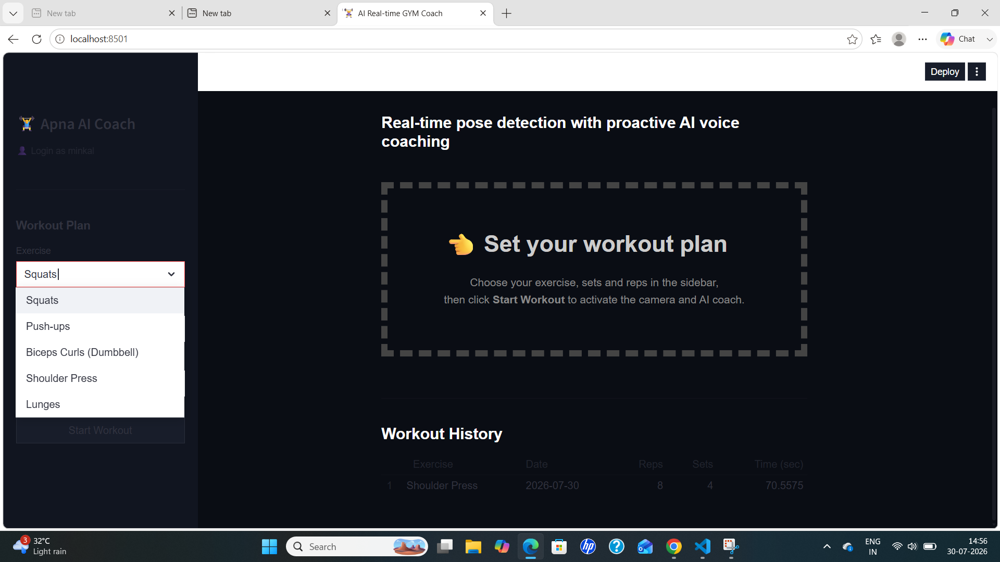
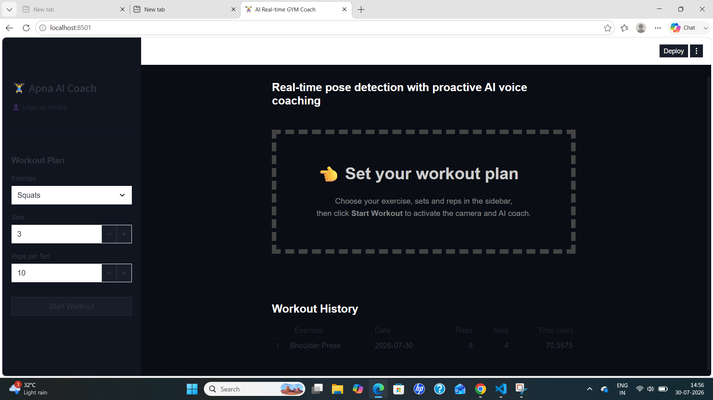
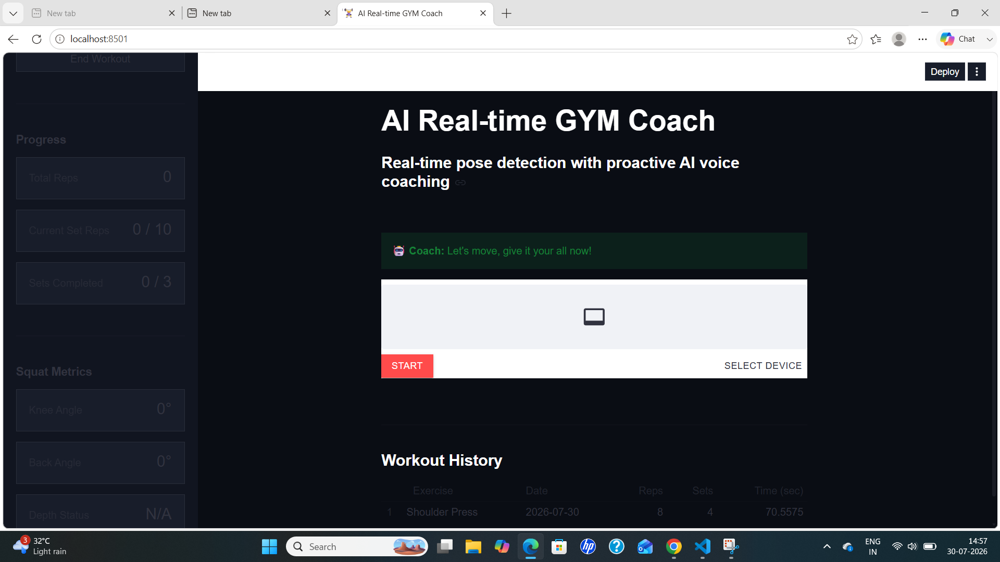

# 🏋️ AI Real-Time Gym Coach

An intelligent AI-powered fitness coach that provides **real-time exercise detection, posture analysis, personalized coaching, and voice feedback** using Computer Vision, Large Language Models (LLMs), and Text-to-Speech (TTS).

The application analyzes workout form through a webcam, tracks repetitions and sets, detects incorrect posture, and provides instant AI-generated coaching to help users perform exercises safely and effectively.

---

# 🚀 Features

* 🎥 **Real-Time Pose Detection** using MediaPipe
* 💪 **Automatic Rep Counting**
* 📊 **Live Workout Metrics**
* 🤖 **AI Workout Coaching** powered by Groq Llama 3.3
* 🔊 **Voice Feedback** using Google Text-to-Speech (gTTS)
* 📈 **Workout History Tracking**
* 👤 **Secure User Login System**
* 🎯 **Exercise Form Analysis**
* 📹 **Live Webcam Support**
* ⚡ **Interactive Streamlit Web Interface**

---
# 📸 Screenshots

### 🔐 Login


### 🏋️ Select Exercise


### 🎯 Set Exercise


### 🎥 Real-Time Exercise Detection


# Supported Exercises

* Squats
* Push-ups
* Biceps Curls
* Shoulder Press
* Lunges

---

# Tech Stack

| Category             | Technologies        |
| -------------------- | ------------------- |
| Programming Language | Python              |
| Frontend             | Streamlit           |
| Computer Vision      | OpenCV, MediaPipe   |
| AI Model             | Groq Llama 3.3 70B  |
| Text-to-Speech       | gTTS                |
| Database             | SQLite              |
| Video Streaming      | streamlit-webrtc    |
| Data Processing      | Pandas              |
| Authentication       | Custom Login System |

---

# Project Architecture

```
                Webcam
                   │
                   ▼
          MediaPipe Pose Detection
                   │
                   ▼
          Exercise Detection Logic
                   │
        ┌──────────┴──────────┐
        ▼                     ▼
 Rep Counter          Form Analysis
        │                     │
        └──────────┬──────────┘
                   ▼
            AI Coaching Engine
             (Groq LLM API)
                   │
                   ▼
          Personalized Feedback
                   │
                   ▼
          Google Text-to-Speech
                   │
                   ▼
           Voice + Text Output
```

---

# Project Structure

```
Real-Time-AI-Coach
│
├── core/
├── detectors/
├── ml_models/
├── services/
│   ├── auth/
│   ├── coaching/
│   ├── config/
│   ├── persistence/
│   ├── tracking/
│   ├── ui/
│   └── vision/
│
├── static/
├── main.py
├── requirements.txt
└── README.md
```

---

# Installation

Clone the repository:

```bash
git clone https://github.com/your-username/Real-Time-AI-Coach.git
```

Move into the project directory:

```bash
cd Real-Time-AI-Coach
```

Create a virtual environment:

```bash
python -m venv .venv
```

Activate the virtual environment:

### Windows

```bash
.venv\Scripts\activate
```

### Linux / macOS

```bash
source .venv/bin/activate
```

Install dependencies:

```bash
pip install -r requirements.txt
```

---

# Environment Variables

Set your Groq API Key before running the project.

### Windows PowerShell

```powershell
$env:GROQ_API_KEY="YOUR_GROQ_API_KEY"
```

### Linux / macOS

```bash
export GROQ_API_KEY="YOUR_GROQ_API_KEY"
```

---

# Run the Application

```bash
streamlit run main.py
```

---

# Workflow

1. Login to the application.
2. Select your exercise.
3. Set target sets and repetitions.
4. Start the workout.
5. Allow webcam access.
6. Perform the exercise.
7. Receive real-time AI coaching.
8. Listen to AI voice feedback.
9. Track completed sets and repetitions.
10. View workout history after the session.

---

# AI Features

* Real-time posture evaluation
* Personalized coaching
* Exercise-specific guidance
* Incorrect form detection
* Voice-assisted workout experience
* Context-aware motivational feedback
* Automatic workout completion feedback

---

# Future Improvements

* More exercise support
* Personalized workout plans
* Multi-language voice support
* Calorie estimation
* Exercise analytics dashboard
* Mobile application
* Cloud deployment
* Wearable device integration


# License

This project is licensed under the MIT License.

---

# Author

**Minkal**

* GitHub: https://github.com/Minkal24
* LinkedIn: https://www.linkedin.com/in/minkal-katariya/

---

⭐ If you found this project useful, consider giving it a star on GitHub!
